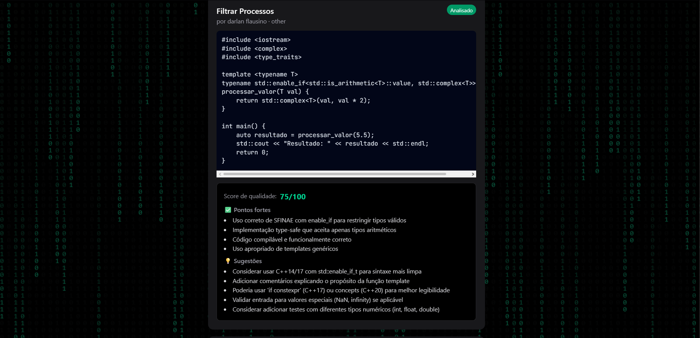
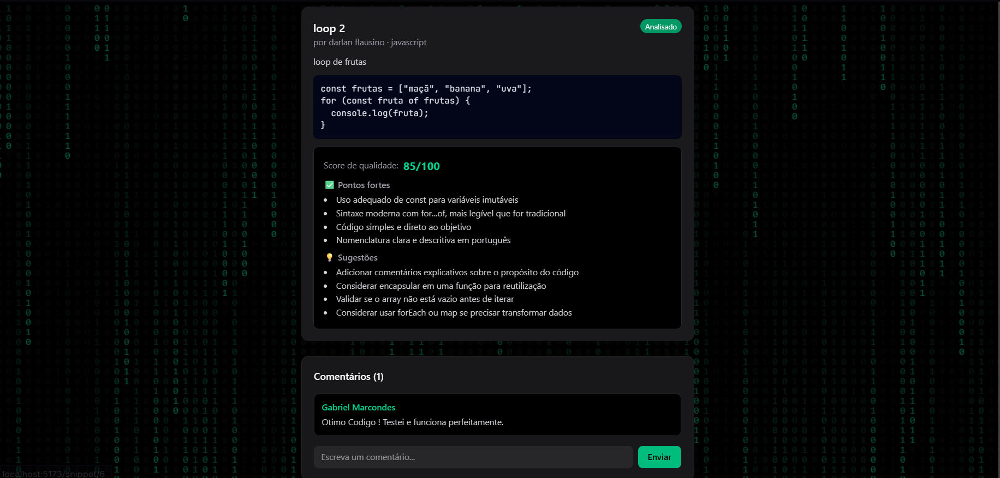

# CodeReview AI 🤖

Plataforma onde desenvolvedores compartilham trechos de código e recebem análises automáticas de qualidade geradas por Inteligência Artificial, além de feedback da comunidade em tempo real.

## 🎯 Motivação

Projeto criado para explorar a integração de LLMs em aplicações reais, indo além de simples chamadas de chat — aqui a IA atua como um "revisor de código" automatizado, com respostas estruturadas e processamento assíncrono em background. É meu primeiro projeto full-stack como recém-formado, em transição de carreira para desenvolvimento.

## 📸 Demonstração





## ⚙️ Funcionalidades

* Autenticação de usuários com JWT
* Postagem de snippets de código em qualquer linguagem
* Análise automática via IA (score de qualidade, pontos fortes, sugestões de melhoria)
* Processamento assíncrono (a IA analisa em background, sem travar a API)
* Atualizações em tempo real via WebSockets (Socket.io)
* Comentários por snippet, também em tempo real

## 🛠️ Tecnologias

**Backend:** Node.js, Express, Sequelize, MySQL, JWT, bcrypt, Socket.io
**IA:** Anthropic API (Claude)
**Frontend:** React, TypeScript, Vite, Tailwind CSS, React Router, Axios

## 🚀 Como rodar localmente

**Backend**
```bash
cd backend
npm install
# configure o .env com suas credenciais (veja .env.example)
npm run dev
```

**Frontend**
```bash
cd frontend
npm install
npm run dev
```

## 📌 Status do projeto

🚧 Em desenvolvimento ativo — backend, frontend e integração com IA funcionais. Próximos passos: app mobile em React Native.

## 👤 Autor

Darlan — [LinkedIn](https://www.linkedin.com/in/darlan-flausino-89250526a) | [GitHub](https://github.com/Darlanfl)